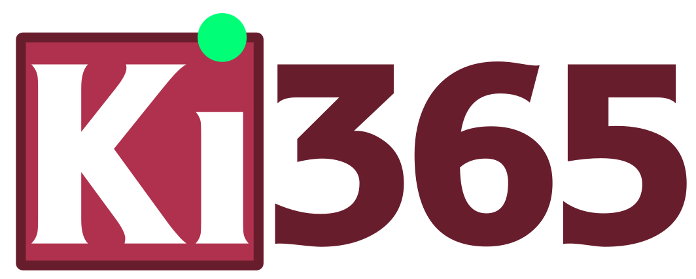
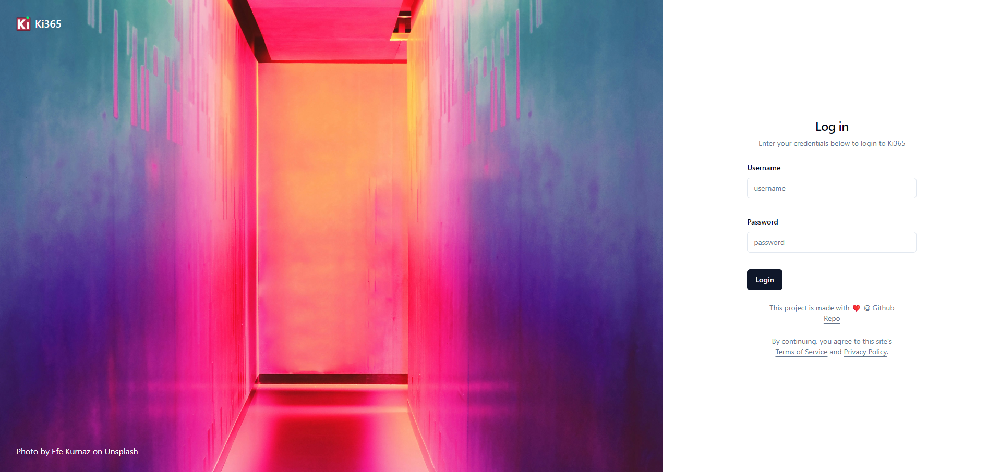
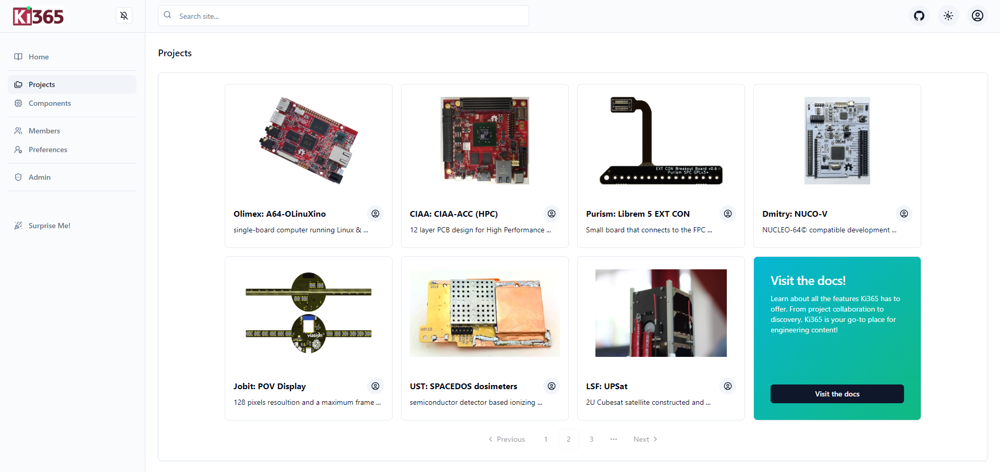
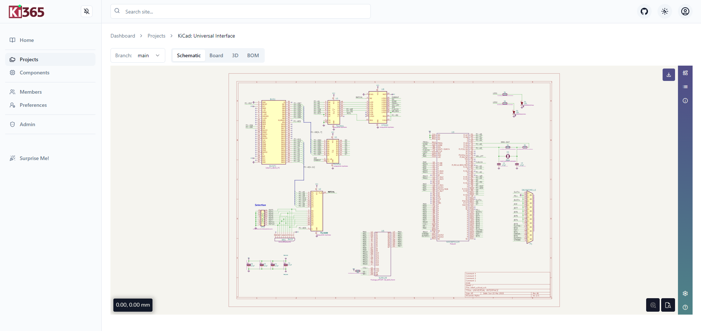

<div align=center>
  
  <h2>Connecting KiCad projects with useful tools, on the web!</h2>
</div>
  
[](https://opensource.org/licenses/Apache-2.0)
[](https://go.dev/talks/2012/splash.article)
[](https://github.com/ki365/Ki365/pkgs/container/ki365)
[](https://github.com/ki365/ki365/graphs/contributors)

KiCad is a great tool! Until you realize the files are only on your computer and not on your coworkers! By combining industry standard web technologies and support for your favorite hosted platform (including self-hosted), we bring KiCad to your browser! 

<div align=center>
  <table>
    <tr>
      <td>
        
      </td>
      <td>
        
      </td>
      <td>
        
      </td>
    </tr>
    <tr>
      <td>
        <h3>Login</h3>
      </td>
      <td>
        <h3>Dashboard</h3>
      </td>
      <td>
        <h3>Project</h3>
      </td>
    </tr>
    </table>
</div>

**_NOTE:_** Ki365 just got started, please bear with us while we create an amazing experience!

## Tech Stack

<details>
  <summary>💻Frontend</summary>
  <ui>
    <li><a href="https://react.dev/">React</a></li>
    <li><a href="https://yarnpkg.com/">Yarn</a></li>
    <li><a href="https://tailwindcss.com/">Tailwind CSS</a></li>
    <li><a href="https://vitejs.dev/">Vite</a></li>
    <li><a href="https://radix-ui.com/">Radix, through ShadCN</a></li>
    <li><a href="https://threejs.org/">Three.js</a></li>
    <li><a href="https://kicanvas.org/">KiCanvas</a></li>
  </ui>
</details>

<details>
  <summary>🔢 Database</summary>
  <ui>
    <li><a href="https://github.com/ostafen/clover">CloverDB: Internal database</a></li>
    <li><a href="https://github.com/etcd-io/bbolt">bbolt: CloverDB key-value store</a></li>
    <li><a href="https://authzed.com/">AuthZed: Authorization</a></li>
  </ui>
</details>

<details>
  <summary>📱Server</summary>
  <ui>
    <li><a href="https://go.dev/">Golang</a></li>
    <li><a href="https://gorilla.github.io/">Gorilla</a></li>
    <li><a href="https://keratin.github.io/">AuthN</a></li>
  </ui>
</details>

<details>
  <summary>🚀 DevOps</summary>
  <ui>
    <li><a href="https://taskfile.dev/">Task</a></li>
    <li><a href="https://github.com/h2non/gock">Gock</a></li>
  </ui>
</details>

## Installation

Ki365 uses the Docker platform to coordinate the application. You can find instructions to start a Ki365 instance, [here](https://ki365.github.io/docs/docs/installation/).

Ki365 includes versions of the supported extensions (see [here](https://ki365.github.io/docs/docs/extensions/) for a list). As such, this requires several programs which need to be installed. To find a description of the interactions between programs and instructions for running bare metal, see [here](https://ki365.github.io/docs/docs/metal/).

## Contributing

> **_WARNING:_** Only use this for development purposes. Please see the documentation on production environments for running a Ki365 instance.

To start the development environment run:

```
git clone https://github.com/Ki365/Ki365.git
cd Ki365
task copy-bin
cp -n .env.template .env
# Terminal one
task dev-backend-api
# Terminal two
task dev-backend-kicad
# Terminal three
task dev-frontend
```
**_NOTE: 1_** The copy-bin and dev-backend commands must be run on a Linux based system. Refer [here](https://github.com/Ki365/Ki365/issues/1).

**_NOTE: 2_** These commands require that the git, task, npm, yarn golang, and docker CLI tools are installed. To check, run the `task check` command.

For further information on contributing please read the [CONTRIBUTING.md](https://github.com/Ki365/Ki365/blob/main/CONTRIBUTING.md) document.

## Design Goals
- Provide a first-class experience for viewing, documenting, and collaborating on KiCad projects
- Foster a community around managing KiCad projects with scalability in mind
- Adhere to industry best practices including accessibility, data privacy, and security

## Frequently Asked Questions (FAQ)

<details>
  <summary>Where does the name come from?</summary>
  To continue the trend of using the suffix 365 to describe "a web enabled platform for sharing content," Ki365 was formed to bring KiCad projects onto the web!
</details>

<details>
  <summary> Isn't there a similarly named project somewhere?</summary>
  Yes, to give credit where credit is due, there was an organization which existed with same name on GitLab but has seen, up to now, little community collaboration
</details>

<details>
  <summary>Why introduce another program?</summary>
  By introducing a new program, we are able to build a product with a fresh stack and with community support! We are excited to bring KiCad to the web!
</details>

<details>
  <summary>How is this different than other projects?</summary>
  Ki365 brings KiCad projects to the web through modern technologies and best practices. This includes great documentation, DevOps, and community support.
</details>

<details>
  <summary>Why was the tech stack chosen?</summary>
  To bring KiCad to the web, many customer stories needed to be met. To meet this goal, we made specific decisions on the tech stack to balance performance, community familiarity, and reliability. If someone knows of a change to the tech stack to help bring us closer to this goal, please, create an issue!
</details>

<details>
  <summary>Is Ki365 officially affiliated with KiCad?</summary>
  No, Ki365 is not officially affiliated with KiCad. Although we strive to create a prominent software ecosystem with KiCad and other tools, we also want to respect the projects and branding of these tools. We hope the remixing of KiCad's branding can uplift both projects in a fair and equitable manner.
</details>

### Logo Disclaimer
The official Ki365 logo is a modified version of the official KiCad logo. The source for this logo is protected under the CC BY-SA 4.0 license which permits remixing and reuse under the condition of providing this disclaimer. This file and its derivatives continue to be protected under the CC BY-SA 4.0 license and shall only be used in compliance with this license. The Ki365 license shall apply to all source content besides the KiCad logo, its derivatives, and any other content which may have their own respective licenses.
